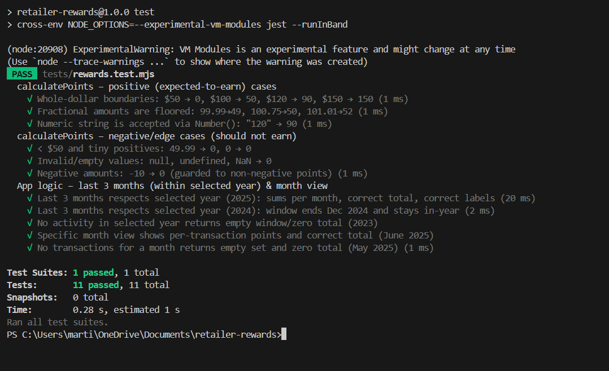

# Retailer Rewards (Vanilla JS)

A simple rewards program simulation built with **Vanilla JavaScript**.  
Customers earn reward points for purchases:
- **2 points** for every dollar spent over $100  
- **1 point** for every dollar spent between $50 and $100  

Example: $120 purchase → `2x20 + 1x50 = 90 points`.

---

## Features
✅ Vanilla JavaScript (no frameworks)  
✅ Mock JSON dataset (`transactions.json`) with **16 customers, 200+ transactions**  
✅ Asynchronous API simulation with delay + error handling  
✅ Logging of API calls, filters, and pagination actions  
✅ Customer pagination  
✅ Year & Month filters (2021–2025 + “Last 3 months”)  
✅ Per-transaction and per-month reward points  
✅ “No transactions” fallback view  
✅ 6 Jest unit tests (positive & negative cases, fractional values, null safety)  

---

## Setup

```bash
# Install dependencies
npm install

# Generate mock dataset (16 customers, ~200+ transactions)
npm run gen:data

# Run unit tests (6 total, all passing)
npm test

# Run app locally (http://localhost:5173)
npm run dev

## Screenshots

### Last 3 Months Summary


### Month View (Per-Transaction)


### Jest Tests Passing
